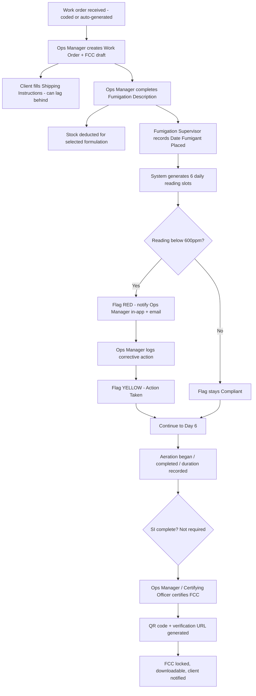
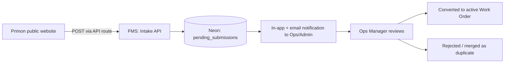
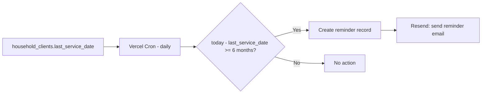
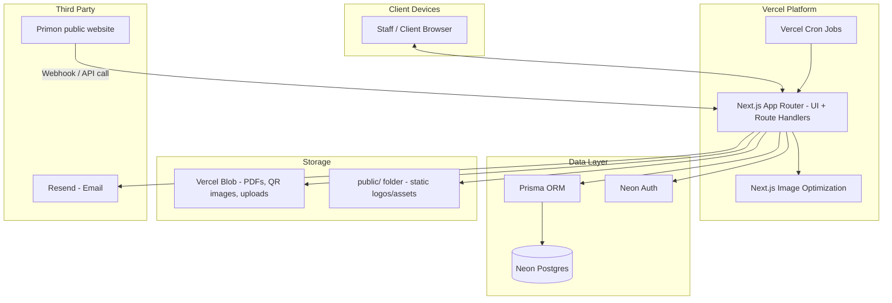
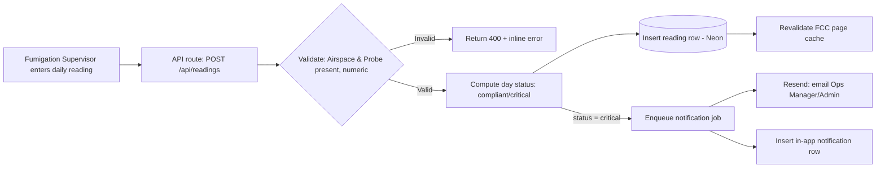

# Primon Fumigation Management System (FMS)
## System Design Document (SDD)

**Last Updated:** August 2026
**Version:** v1.0 (Base)
**Framework:** M.A.S.T.E.R. (Model → Architecture → Scale → Tradeoffs → Execution → Resilience)

**Brief Project Description:** A web-based system for Primon Enterprises Limited (Lilongwe, Malawi) that digitises the Fumigation Conformance Certificate (FCC) for tobacco and grain fumigation, replaces WhatsApp-based gas-reading reporting with structured 6‑day monitoring and critical-threshold alerting, tracks fumigant/formulation stock, issues QR-verifiable certificates, and manages work order / RFQ / RFW intake from the public Primon website plus 6‑monthly household pest-control reminders.

**Source requirements:** *Primon FMS Requirements Document v1.0* and the reviewed FCC sample layout (`FCC-2026-000512`).

---

## Stack Summary (fixed inputs for this design)

| Layer | Choice |
|---|---|
| Framework | Next.js (App Router, file-based routing), TypeScript |
| Repo structure | Monorepo — single Next.js app |
| API layer | Next.js Route Handlers (`app/api/**/route.ts`) |
| Database | Neon (serverless Postgres) |
| ORM | Prisma ORM (`prisma`, `@prisma/client`, `@prisma/adapter-neon`) |
| Auth | Neon Auth |
| File/object storage | Vercel Blob |
| Static assets | `public/` folder + Next.js Image Optimization |
| Email | Resend |
| Hosting | Vercel |

---

## M — MODEL THE SYSTEM (Requirements & Constraints)

### 1. Functional Requirements

Grouped by the FMS modules defined in the requirements document:

**Work Order Management**
- Create work orders with an externally-supplied code (e.g. Alliance One) or an auto-generated code (`WO-YYYY-#####`).
- Ingest work order / RFQ / RFW submissions from the public Primon website as pending items for staff review.
- Search/filter work orders by code, client, crop type, status.

**FCC Lifecycle**
- Build an FCC across four sections: Shipping Instructions (SI), Fumigation Description, Fumigation Data (6-day readings), Certification & Sign-off.
- Support out-of-order completion: fumigation and gas readings may proceed before SI data is complete.
- Status lifecycle: `draft → in_progress → under_review → certified`, with a parallel `flagged` sub-state.
- Header metadata per the reviewed sample: Sales Order No., Shipment No., Delivery No. (optional, client-supplied), plus internal FCC number (`FCC-YYYY-######`).

**Shipping Instructions (SI)**
- Client-editable fields: Tobacco Supplier, Consignee, Fumigation Contractor (pre-filled), Crop Year, Tobacco Type, Net Weight, Quantity, Polylined, Grade Name, Case Nos., Country of Origin, Location, Warehouse Section.
- Editable by the client until certification; read-only after.

**Fumigation Description**
- Fields: Type of Fumigation (Container / Sheeted Stack), Fumigant (Aluminium Phosphide / Magnesium Phosphide), Formulation (crop-type-dependent), Total Volume Fumigated (m³), Dose (g/m³), Total Fumigant Used (g).
- Formulation options are filtered dynamically by fumigant + crop type, and constrained to current stock on hand.
- Saving this section deducts the used quantity from fumigant stock (transactional).

**Fumigation Data — 6-Day Gas Readings**
- Recording "Date Fumigant Placed" auto-generates 6 sequential daily reading slots.
- Each day: Airspace (ppm) and Probe/Case (ppm) mandatory; Ambient Temp, Product Temp, Relative Humidity optional.
- Day status derived automatically: **Compliant** (≥600ppm both), **Critical** (<600ppm either — red), **Action Taken / Pending Confirmation** (yellow, after a logged corrective action).
- Corrective action log: free-text entry + timestamp + acting user, tied to the specific day/reading.
- Aeration Began, Aeration Completed, and Duration / Total Hours Under Gas captured at close-out (per reviewed sample; supersedes the original "date de-gassed" wording — to confirm terminology with Ops).

**Certification & Signatures**
- Three-party e-signature block: Supervising Fumigator, For the Supplier, Certifying Officer (name + system-timestamp in lieu of wet signature).
- Certification locks all sections and generates the QR code + public verification URL (`verify.primon.mw/fcc/{certificateId}`).

**Inventory (v1 — minimal)**
- Stock levels per fumigant/formulation (Sachet 11g, Tablet 1g, Plate 33g).
- Auto-deduction on Fumigation Description save; manual adjustment by Admin; low/zero-stock warnings; full movement log.

**Notifications**
- Critical gas reading → in-app + email to Operations Manager/Admin, near-real-time.
- FCC certified → in-app + email to client and Operations Manager.
- New website submission → in-app + email to Operations Manager/Admin.
- Household 6-month reminder → email (SMS deferred).
- Low/zero stock → in-app + email to Admin.

**Client Portal**
- Read-only view of the full FCC at any stage; edit access limited to own SI fields pre-certification; download certified FCC (PDF) once available.

**Household Pest Control (v1 scope: intake + reminders only)**
- Public-site RFQ/RFW/work-order submission ingestion.
- Track last completed service date per household client; auto-email reminder at 6 months.

### 2. Non-Functional Requirements

| Attribute | Target / Approach |
|---|---|
| Availability | 99.5%+ — acceptable for an SME operational tool; inherited largely from Vercel + Neon SLAs rather than custom multi-region engineering. |
| Scalability | Must comfortably handle Primon's current and 5-year-projected volume (see Scale section) without re-architecture — not designed for internet-scale traffic. |
| Latency | Interactive pages < 1s p95; API route handlers < 500ms p95 (excluding email/PDF generation, which are async). |
| Throughput | Low — tens of concurrent users, dozens of work orders/month at most. Sized for correctness and auditability over raw throughput. |
| Security | Role-based access control (Neon Auth), least-privilege DB roles, signed/expiring Blob URLs for sensitive documents, HTTPS everywhere (Vercel default). |
| Compliance | Certificate immutability post-certification; full audit trail (who/when) on readings, corrective actions, stock movements — supports Pesticides Control Board accountability. |
| Disaster Recovery | Neon point-in-time recovery; Vercel Blob durability; documented RTO/RPO (see Resilience section). |
| Observability | Structured logs, Vercel platform metrics, and application-level audit log table as the durable source of truth for compliance events (separate from ephemeral platform logs). |
| Cost | Optimise for an SME budget — serverless/pay-as-you-go across Vercel, Neon, Resend, Blob; avoid always-on infrastructure. |

### 3. Constraints

- **Team/skillset:** Small dev team building on a TypeScript/Next.js monorepo — favours an integrated, low-ops stack (Vercel + Neon + Prisma) over a multi-service architecture.
- **Traffic:** Low — internal staff (single-digit to low tens of concurrent users) plus occasional client/public-site traffic; no internet-scale load expected.
- **Data size:** Modest — work orders, FCCs, and readings are structured, small records; the larger storage driver is generated PDFs and QR images, not raw data volume.
- **Connectivity:** Field connectivity at fumigation sites confirmed reliable — no offline-first requirement.
- **Geography:** Primary users in Malawi; Vercel's nearest edge regions are outside Africa, so expect baseline latency in the low hundreds of ms for edge/API calls — acceptable given the low-throughput, non-real-time-critical nature of most flows (the one exception, gas-reading alerts, is notification-latency-sensitive, not page-latency-sensitive).
- **Budget:** SME budget — favours free/low tiers of Neon, Vercel, and Resend for v1, scaling tier as usage grows.
- **Regulatory:** Certificates must remain a defensible compliance record (Pesticides Control Board) — drives the immutability and audit-trail requirements above.

### 4. Success Metrics

- Critical gas-reading alert delivered (in-app + email) within **2 minutes** of the reading being saved.
- Certified FCC (with QR) downloadable within **5 seconds** of certification action.
- 99.5% monthly uptime for the application.
- Zero data loss on stock deductions or reading entries (enforced via DB transactions, not eventual consistency).
- 100% of certified FCCs independently verifiable via QR/public link.

---

## A — ARCHITECT (High-Level Architecture)

### 1. User Flow Diagrams

**Flow: Tobacco Work Order → Certified FCC**



**Flow: Public Website Intake (Work Order / RFQ / RFW)**



**Flow: Household 6-Month Reminder**



### 2. System Components Diagram



### 3. Data Flow Diagram



### 4. Database Schema / Data Model (Prisma)

Core tables (fields abbreviated to key columns; full types/constraints defined in Prisma schema file under `prisma/schema.prisma`):

```
users               id, name, email, role (supervisor|ops_manager|admin|client|executive), createdAt
work_orders         id, code, source (client_supplied|auto_generated|website), cropType (tobacco|grain),
                    scale (industrial|smallholder|household), status, clientId, salesOrderNo, shipmentNo,
                    deliveryNo, createdBy, createdAt

fccs                id, workOrderId (FK), certificateNumber, status (draft|in_progress|under_review|
                    certified|flagged), certifiedAt, certifiedBy, qrCodeUrl, verificationUrl

shipping_instructions  id, fccId (FK), tobaccoSupplier, tobaccoSupplierAddress, consignee, consigneeAddress,
                    fumigationContractor, cropYear, tobaccoType, netWeight, quantity, polylined,
                    gradeName, caseNos, countryOfOrigin, location, warehouseSection, lockedAt

fumigation_descriptions  id, fccId (FK), fumigationType (container|sheeted_stack), fumigantId (FK),
                    formulationId (FK), doseGm3, totalVolumeM3, totalFumigantUsedG, recordedBy, recordedAt

fumigants           id, name (aluminium_phosphide|magnesium_phosphide)
formulations        id, fumigantId (FK), cropType (tobacco|grain), name (sachet_11g|tablet_1g|plate_33g),
                    unit

stock_levels        id, formulationId (FK), quantityOnHand, lowStockThreshold, updatedAt
stock_movements      id, formulationId (FK), workOrderId (FK, nullable), type (deduction|addition|
                    adjustment), quantity, note, performedBy, performedAt

gas_readings         id, fccId (FK), dayNumber (1-6), readingDate, airspacePpm, probeCasePpm,
                    ambientTempC, productTempC, relativeHumidityPct, status (compliant|critical|
                    action_taken), enteredBy, enteredAt

corrective_actions    id, gasReadingId (FK), description, actionTakenAt, resolvedAt, loggedBy

fumigation_closeout   id, fccId (FK), datePlaced, aerationBegan, aerationCompleted,
                    durationHours

signatures           id, fccId (FK), role (supervising_fumigator|supplier_rep|certifying_officer),
                    signerName, signedAt

notifications        id, userId (FK), type, payload (jsonb), channel (in_app|email), readAt, createdAt
audit_log            id, entityType, entityId, action, actorId, diff (jsonb), createdAt

household_clients    id, name, contactEmail, contactPhone, address, lastServiceDate
household_reminders  id, householdClientId (FK), dueDate, sentAt, channel

pending_submissions   id, sourceType (work_order|rfq|rfw), payload (jsonb), status
                    (pending|converted|rejected), receivedAt, reviewedBy
```

**Key design notes**

- `gas_readings.status` is **derived and stored**, not computed on read only — this keeps the audit trail exact even if the 600ppm threshold constant is later revised.
- `stock_movements` is append-only; `stock_levels.quantityOnHand` is a maintained aggregate, recalculable from movements if ever needed (defence against drift).
- Certification is enforced at the application layer as a transaction: write signatures → set `fccs.status = 'certified'` → lock `shipping_instructions` (`lockedAt`) → generate QR/Blob asset, all inside one DB transaction plus a follow-up async job for the PDF/QR generation.

### 5. API Structure (Next.js Route Handlers)

```
app/api/
  work-orders/
    route.ts                 GET (list/search), POST (create)
    [id]/route.ts             GET, PATCH
  fccs/
    [id]/route.ts             GET
    [id]/si/route.ts          PATCH (client SI edits, blocked if locked)
    [id]/fumigation-description/route.ts   POST/PATCH
    [id]/certify/route.ts     POST (transactional certification)
  readings/
    route.ts                  POST (daily reading entry)
    [id]/corrective-action/route.ts  POST
  stock/
    route.ts                  GET
    adjust/route.ts           POST (Admin only)
  intake/
    website/route.ts          POST (public website → pending_submissions; API-key or HMAC signed)
    pending/[id]/convert/route.ts  POST
  household/
    reminders/run/route.ts    POST (invoked by Vercel Cron)
  verify/
    [certificateId]/route.ts  GET (public — verification payload)
  auth/**                      Neon Auth handlers
```

- Public-facing endpoints (`intake/website`, `verify/[certificateId]`) are the only unauthenticated routes and are rate-limited and payload-validated distinctly from internal routes.
- All internal routes are protected by Neon Auth session + role check (middleware).

### 6. Deployment Architecture

- Single Vercel project, single Next.js app (monorepo) — UI and API route handlers deployed together, scaling as one unit.
- Neon Postgres accessed via Prisma using `@prisma/adapter-neon` with Neon's serverless HTTP/WebSocket driver (not a persistent TCP pool), matching Vercel's serverless function model.
- Vercel Cron triggers `POST /api/household/reminders/run` daily.
- Vercel Blob stores generated FCC PDFs and QR code images, referenced by URL from `fccs.qrCodeUrl`.
- Static brand assets (logo, icons used in the FCC header) live in `public/` and are served via Next.js Image Optimization.

---

## S — SCALE THE SYSTEM (Capacity Planning & Traffic Model)

### 1. Traffic Estimation

Primon is an SME, not a high-traffic consumer product — sizing is deliberately conservative:

- **Daily active users:** low tens (Ops Managers, Admin, Fumigation Supervisors, occasional client logins).
- **Peak RPS:** well under 10 — bursts occur around daily reading-entry windows (a handful of supervisors submitting readings within the same hour) and around website RFQ submission spikes (marketing-driven, still low volume).
- **Uploads:** FCC PDFs are small (a few hundred KB); QR images are trivial in size.
- **Read/write ratio:** read-heavy for clients tracking progress; write-heavy in short bursts during active fumigation windows.

### 2. Capacity Planning

- **Compute:** Vercel serverless functions auto-scale per request — no pre-provisioning needed at this traffic level; Vercel's free/Pro tier is sufficient for v1.
- **Database:** Neon's free or launch tier comfortably covers expected row volumes (hundreds of work orders/year, thousands of reading rows/year). Neon's autoscaling compute handles the infrequent bursts without manual tuning.
- **Storage:** Vercel Blob usage grows linearly with certified FCCs (~1 PDF + 1 QR image per certificate) — negligible cost at Primon's volume even over several years.
- **Network:** No CDN-heavy workload; Next.js Image Optimization and Vercel's edge network are sufficient for the limited static assets involved.

### 3. Scalability Design

- **Horizontal scaling:** inherent to Vercel's serverless model — no explicit action required.
- **Vertical scaling:** Neon compute can be scaled up (more vCU) if reading-heavy periods ever cause contention; not expected at current volumes.
- **Caching:** Next.js data cache / `revalidateTag` for read-heavy, slow-changing views (e.g. certified FCC public verification page); no caching on mutation-heavy routes (readings, stock).
- **Rate limiting:** applied at the public intake and verification endpoints (e.g. via Vercel's edge middleware or a lightweight token-bucket check against Neon) to protect against scraping/abuse of the public site.
- **Database scaling levers held in reserve (not needed for v1):** read replicas, connection pooling beyond Neon's built-in pooler, sharding/partitioning — all overkill at current scale but documented here so the schema doesn't preclude them later (e.g. `gas_readings` could be partitioned by year if the dataset ever grows large).

### 4. Bottleneck Identification

| Potential bottleneck | Assessment | Mitigation |
|---|---|---|
| Neon connections under serverless concurrency | Real but well-understood risk with Vercel + Postgres | Use Neon's serverless driver (HTTP/WebSocket) via `@prisma/adapter-neon`, not raw TCP pooling, to avoid connection exhaustion. |
| Email delivery (Resend) during multi-recipient certification/alert bursts | Low risk at current volume | Queue non-blocking; retry with backoff; Resend's rate limits comfortably exceed Primon's alert volume. |
| Cross-region latency (Vercel edge regions vs. Malawi users) | Moderate, inherent to hosting choice | Not addressed with multi-region infra at this stage — acceptable given non-real-time nature of most flows; revisit only if user complaints arise. |
| Vercel Blob growth over years | Negligible at current volume | Periodic lifecycle review, not urgent. |

This system is explicitly **not** being designed to survive "1,000,000 users" — that scale profile does not apply to an SME operational tool, and over-engineering here would waste budget better spent on FCC/compliance correctness.

---

## T — TRADEOFFS (Technology & Architecture Decisions)

### 1. Database: Postgres (Neon) — chosen over NoSQL
Work orders, FCCs, and their sub-sections are strongly relational with real transactional needs (stock deduction, certification locking, audit trail). Postgres's ACID guarantees and Prisma's query engine and type-safe client are a natural fit; NoSQL would force awkward joins/denormalisation for reporting and audit queries with no throughput benefit at this scale.

### 2. ORM: Prisma — chosen over Drizzle
Prisma's intuitive schema definition language (`schema.prisma`), powerful query engine, auto-generated type-safe client, robust migration system (`prisma migrate`), and seamless Neon serverless adapter (`@prisma/adapter-neon`) provide strong developer ergonomics, reliable migrations, and type-safe transactional guarantees for compliance workflows.

### 3. Auth: Neon Auth — chosen over a custom/third-party auth service
Keeps auth colocated with the database provider already in use, reducing integration surface area for an SME-scale app where a dedicated identity provider (e.g. Auth0, Clerk) would add cost and complexity disproportionate to the user count. Role-based access (Supervisor / Ops Manager / Admin / Client / Executive) is modelled directly against Neon Auth's user/session primitives.

### 4. API protocol: REST via Route Handlers — chosen over GraphQL/gRPC
The API surface is a fixed, well-known set of resources (work orders, FCCs, readings, stock) rather than an open client-driven query surface — REST route handlers keep this simple, cacheable, and easy to secure per-route, without GraphQL's added schema/resolver overhead for a small team.

### 5. Storage: Vercel Blob — chosen over S3
Tight integration with the existing Vercel deployment (no separate cloud account/IAM setup) is worth more than S3's broader ecosystem at this scale; Blob's simple URL-based access model fits the "download the certified FCC" and "scan the QR" use cases directly.

### 6. Static assets: `public/` + Next Image Optimization — chosen over Blob for brand assets
Static, rarely-changing assets (logo, icons) don't need Blob's dynamic-upload model; keeping them in `public/` is simpler to version-control and Next.js Image Optimization handles resizing/formats automatically. Blob is reserved for **generated, per-record** assets (QR codes, certified PDFs).

### 7. Deployment shape: Monorepo, single Next.js app — chosen over microservices
A small team and moderate feature surface favour one deployable unit with file-based routing over the operational overhead of multiple services; nothing in the current requirements (no independent scaling needs per module) justifies splitting out separate services.

### 8. Consistency: strong consistency where it matters, eventual elsewhere
Stock deduction and certification are wrapped in DB transactions (strong consistency — a stock or certificate error is a compliance/financial problem). Notification delivery (email/in-app) is allowed to be eventually consistent (a few seconds' delay is acceptable) since it's advisory, not part of the compliance record itself.

### 9. Cost vs. performance
Every choice above (Neon, Vercel, Resend, Blob) is a pay-as-you-go/generous-free-tier service, deliberately avoiding always-on infrastructure (e.g. self-managed Kubernetes) that would be disproportionate to an SME's traffic and budget.

---

## E — EXECUTION PLAN (DevOps, Hosting, Domains, CI/CD)

### Hosting Plan

| Component | Service |
|---|---|
| Frontend + API (Next.js App Router, Route Handlers) | Vercel |
| Database | Neon (Postgres, serverless driver via `@prisma/adapter-neon`) |
| Auth | Neon Auth |
| File storage (PDFs, QR images) | Vercel Blob |
| Static assets | `public/` + Next.js Image Optimization |
| Transactional email | Resend |
| Scheduled jobs (household reminders) | Vercel Cron |

### Domain & DNS Setup

Building on the naming already implied by the reviewed FCC sample (`verify.primon.mw/fcc/...`):

- `fms.primon.mw` (or similar) → main internal/client application, pointed at Vercel via CNAME.
- `verify.primon.mw` → public certificate verification route (can be the same Vercel deployment, routed internally to `/verify/[certificateId]`, or a distinct subdomain alias — recommend keeping it one deployment for simplicity, with the subdomain purely a friendlier public-facing URL).
- DNS managed via Cloudflare (or the current registrar) with CNAME records to Vercel; SSL certificates auto-provisioned by Vercel.

### Infrastructure as Code

- **Database schema/migrations:** Prisma schema and migrations committed to the repo (`prisma/schema.prisma`, `prisma/migrations/`), applied via `prisma migrate deploy` in CI before deploy.
- **Vercel project config:** `vercel.json` (redirects, cron schedule) committed to the repo.
- No separate Terraform/Pulumi layer is warranted — Vercel + Neon + Resend are all managed via their own dashboards/CLI and version-controlled config files, which is proportionate for this scale.

### CI/CD Pipeline

- **GitHub Actions:** typecheck, lint, run Prisma schema validation (`npx prisma validate`), run tests on every PR.
- **Vercel Git integration:** automatic preview deployments per PR (useful for Ops Manager/CEO to review UI changes before merge); automatic production deploy on merge to `main`.
- **Migrations:** run as a pre-deploy step (Vercel build step or a GitHub Actions job) against Neon before the new app version goes live, with a rollback plan (Neon branching can create a pre-migration branch snapshot for safety).

### Security

- Role-based access control enforced in middleware on every internal route, backed by Neon Auth sessions.
- Public routes (`intake/website`, `verify/[certificateId]`) validated independently: HMAC/API-key check on website submissions; read-only, non-sensitive payload on verification.
- Secrets (Neon connection string, Resend API key, Blob token) stored as Vercel encrypted environment variables, never committed.
- Audit logging (`audit_log` table) as the durable compliance record, independent of any third-party platform logs.

---

## R — RESILIENCE (Reliability Engineering & Observability)

### Reliability Layers

- **Platform redundancy:** inherited from Vercel (multi-AZ serverless execution) and Neon (managed Postgres with built-in failover) — no custom failover logic required at this scale.
- **Retry/backoff:** applied to Resend email sends and Vercel Blob uploads (both idempotent operations, safe to retry on transient failure).
- **Idempotent cron/webhook handlers:** `household/reminders/run` and `intake/website` are designed to be safely re-invoked (e.g. re-running the daily reminder job twice in a day must not double-send emails — enforced via a `sentAt` check before send).
- **Transactional integrity:** certification and stock-deduction flows use DB transactions so a partial failure cannot leave stock or certificate state inconsistent.

### Observability

- **Application logs:** Vercel's built-in function logs for request-level debugging.
- **Compliance/audit trail:** the `audit_log` table is the authoritative, queryable record of who did what and when — not dependent on ephemeral platform log retention.
- **Error tracking:** recommend a lightweight integration (e.g. Sentry free tier) for exception visibility across route handlers, proportionate to team size.
- **Metrics:** Vercel Analytics for request volume/latency; Neon's dashboard for database load — sufficient for an SME operational tool without standing up Prometheus/Grafana.

### SLOs / SLIs

| SLI | SLO |
|---|---|
| App availability | ≥ 99.5% monthly |
| Critical gas-reading alert latency | ≤ 2 minutes from reading save to notification dispatch |
| API route handler latency (excl. async jobs) | p95 < 500ms |
| Certified FCC generation | < 5 seconds from certify action to downloadable PDF |

### Disaster Recovery

- **Database:** Neon point-in-time recovery (PITR) — target **RPO: ≤ 24 hours** (well within Neon's default retention), **RTO: a few hours** (manual restore via Neon console, acceptable for an internal operational tool without 24/7 on-call staffing).
- **File storage:** Vercel Blob is durable by design; certified FCC PDFs can also be regenerated on demand from the underlying database record if the Blob object were ever lost, since the FCC data itself (not just the rendered PDF) is the source of truth.
- **Backups:** rely on Neon's automated backups rather than a custom backup pipeline — proportionate to team size and data volume.

### Chaos / Failure-Mode Considerations (lightweight, not full chaos engineering)

- **Resend outage:** notification failures are logged and retried; critical alerts also always create an in-app notification row so staff aren't solely dependent on email delivery.
- **Neon connection failure:** serverless driver calls fail fast with clear error surfaces to the UI rather than hanging requests; route handlers surface a retry-safe error state.
- **Vercel Cron miss:** household reminder job is date-driven (checks `last_service_date` against "today"), so a missed run is self-correcting on the next successful invocation rather than silently losing a reminder.

---

## Open Items Carried Over from the Requirements Document

These remain unresolved and should be confirmed before/during build, per Section 13.2 of the FRS:

- Exact unit/instrument for the 600 reading threshold (assumed ppm based on the reviewed sample).
- Whether the 6-day window includes or skips weekends/holidays.
- Whether corrective actions should use a defined action-type list vs. free text (currently modelled as free text in `corrective_actions.description`).
- Escalation path if a critical reading goes un-actioned within a defined time window.
- Confirm whether "Date De-gassed" (original FRS wording) and "Aeration Began / Completed / Duration" (reviewed sample wording) are the same concept or need to coexist.
- CEO/Executive dashboard scope — not yet designed; recommend a follow-up SDD addendum once reporting requirements are gathered.
